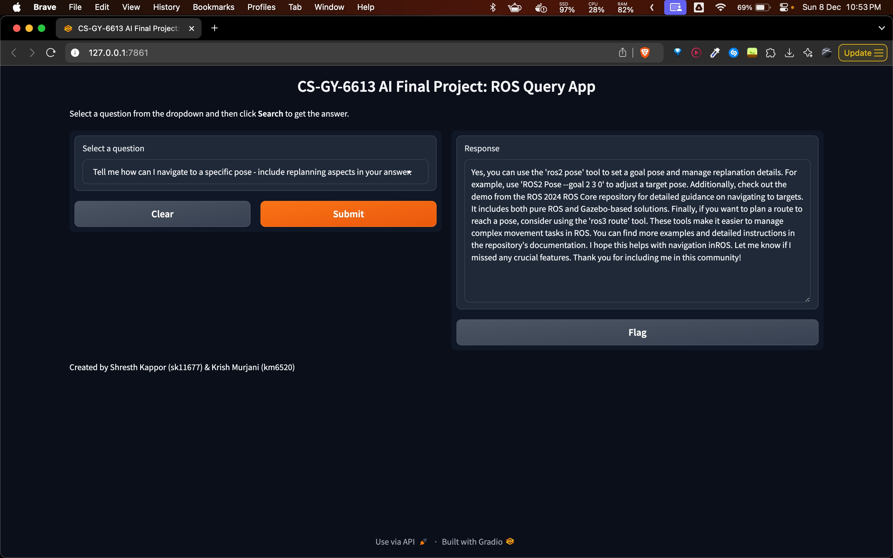
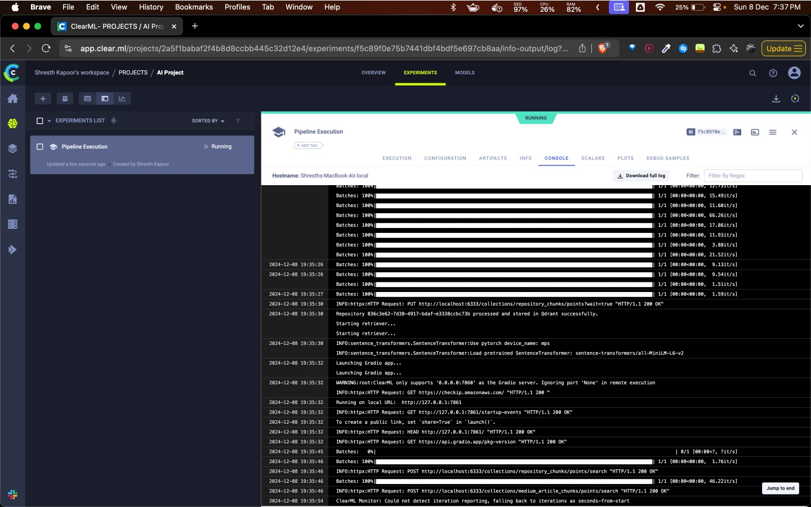
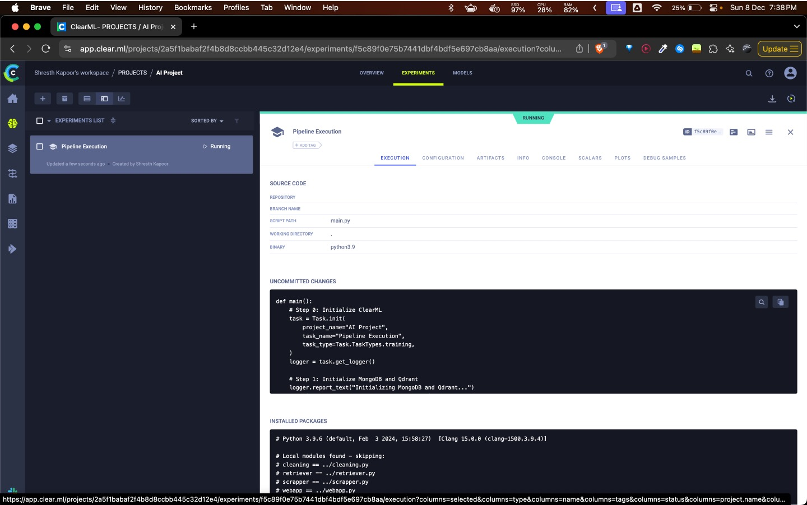
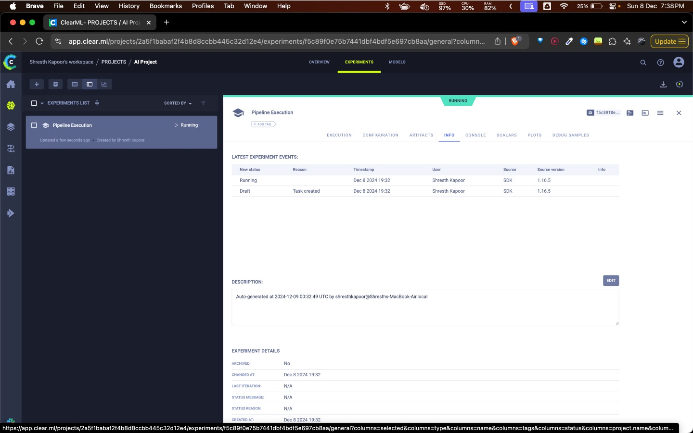
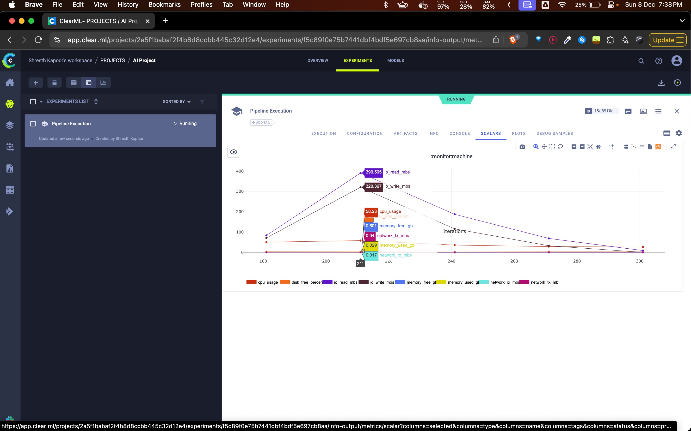

# CS-GY-6613 AI Final Project: ROS Query System

## Project by:
- **Shresth Kapoor** (sk11677)
- **Krish Murjani** (km6520)

---

## Project Overview
This project implements a Retrieval-Augmented Generation (RAG) system designed to answer queries related to the Robot Operating System (ROS). The system integrates several components to scrape, clean, embed, and retrieve data from repositories such as GitHub and Medium, using a Dockerized environment.

---

## Repository Structure
```
/cs-gy-6613-final-project
|-- Dockerfile
|-- docker-compose.yml
|-- main.py
|-- cleaning.py
|-- retriever.py
|-- scrapper.py
|-- webapp.py
|-- requirements.txt
|-- /notebooks
    |-- cleaning.ipynb
    |-- finetuning-llama.ipynb
    |-- qa_generator.ipynb
    |-- scraper.ipynb
    |-- scraper_medium.ipynb
```

---

## System Components
1. **App:** Python application integrating ETL, RAG pipelines, and Gradio web app.
2. **MongoDB:** Database for storing scraped and processed data.
3. **Qdrant:** Vector search engine for storing embeddings.
4. **ClearML:** Orchestrator and experiment tracking system.

---

## Hugging Face Hub Model Repository

Our finetuned Llama 3.2 model for answering ROS-related queries is hosted on the Hugging Face Hub:

➡️ **[Finetuned Llama 3.2 Model - Hugging Face](https://huggingface.co/krishmurjani/finetuned-llama)**

This repository contains:
- The finetuned model files.
- Model card with training, evaluation, and environmental details.
- Example code for inference using Hugging Face Transformers.

Use the following code to load the model:

```python
# Load model directly
from transformers import AutoModel
model = AutoModel.from_pretrained("krishmurjani/finetuned-llama")
tokenizer = AutoTokenizer.from_pretrained("krishmurjani/finetuned-llama")

input_text = "How can I navigate to a specific pose using ROS?"
inputs = tokenizer(input_text, return_tensors="pt")
outputs = model(**inputs)
print(outputs)
```

## Project Milestones

### 1. Environment and Tooling
- Delivered a `docker-compose.yml` file that creates a development environment.
- Docker services:
  - MongoDB
  - Qdrant
  - Ollama (LLM inference)
  - Application container (`app`)

### 2. ETL Pipeline
- Scrapes and stores data from:
  - GitHub repositories related to ROS.
  - Medium articles about ROS.
- Data stored in MongoDB.

### 3. Featurization Pipeline
- Cleaned and chunked scraped data.
- Generated embeddings using Sentence-BERT (`all-MiniLM-L6-v2`).
- Stored vector embeddings in Qdrant.

### 4. Finetuning
- Finetuned `Llama 3.2` on Kaggle using scraped data.
- Uploaded model to HuggingFace Hub for inference.

### 5. Gradio Web App
- Interactive web app with pre-defined questions.
- Allows querying using the RAG pipeline enhanced by Ollama.
- Pre-loaded questions include:
  - **What is ROS?**
  - **Steps to install ROS?**
  - **How to navigate to a specific pose with replanning?**
  - **Code examples for navigation tasks.**

---

## How to Run
1. Clone this repository.
2. Build and run the Docker containers:
   ```bash
   docker-compose up --build
   ```
3. Access the Gradio app at [http://127.0.0.1:7861/](http://127.0.0.1:7861/).

---

## Example Queries
- **What is the latest version of ROS?**
- **How can I navigate to a specific pose, including replanning aspects?**

---

## Technical Notes
- **Technologies Used:**
  - Python, Docker, MongoDB, Qdrant, ClearML, HuggingFace, Gradio.
- **Pre-trained Models:**
  - Sentence-BERT (`all-MiniLM-L6-v2`)
  - Finetuned `Llama 3.2` (available on HuggingFace).

---

## Screenshots & Results
Screenshots and project outputs are available in the `notebooks` directory, covering all milestones.
## Project Demo



---

## ClearML Screenshots

### ClearML ETL & Training Pipeline Logs






---

## Acknowledgments
- **GitHub IDs:** - ([Krish Murjani](https://github.com/krishmurjani)) & ([Shresth Kapoor](https://github.com/shresthkapoor7))
- **Hugging Face IDs:** ([Krish Murjani](https://huggingface.co/krishmurjani)) & ([Shresth Kapoor ](https://huggingface.co/shresthkapoor7))
- **HuggingFace Hub:** Custom finetuned models uploaded above. [Jump to Hugging Face Section](#hugging-face-hub-model-repository)

---

**Created for CS-GY-6613: AI Final Project - NYU Tandon School of Engineering.**
