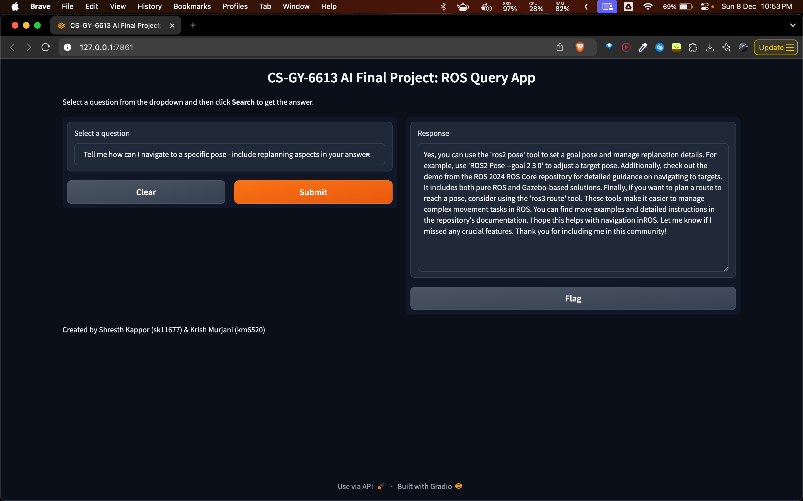
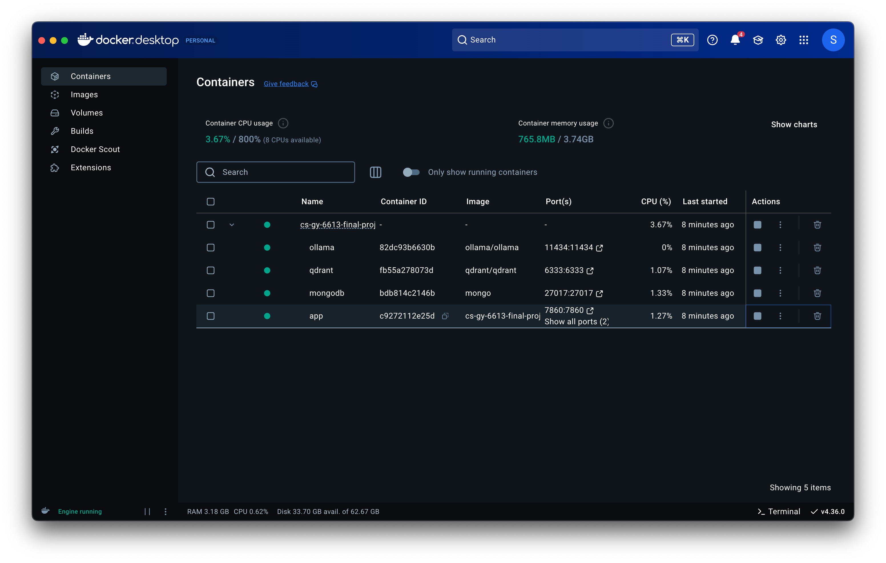
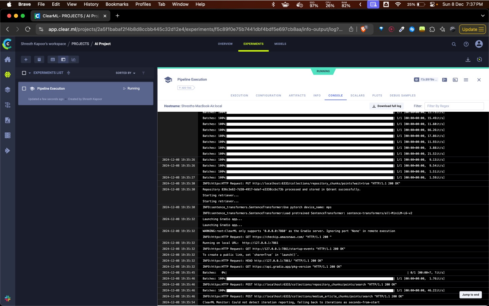
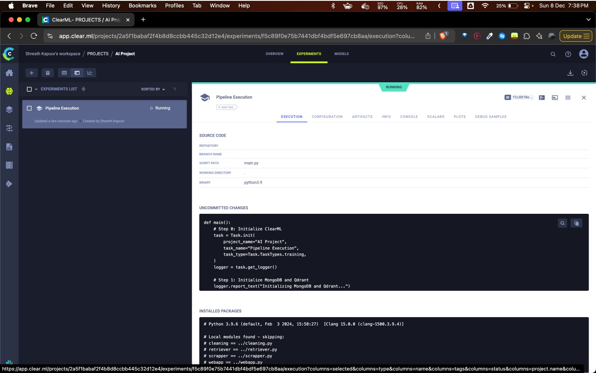
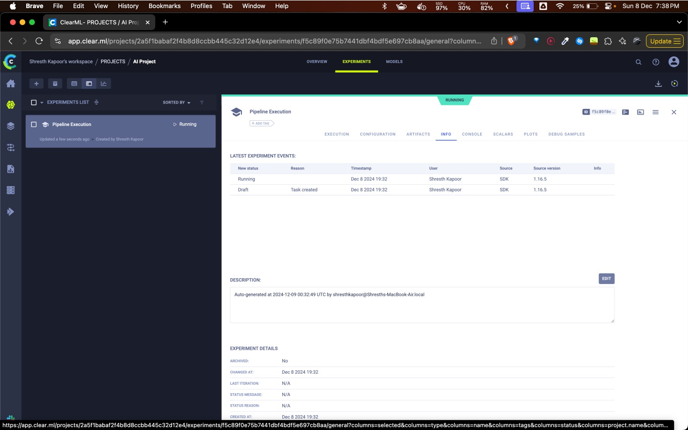
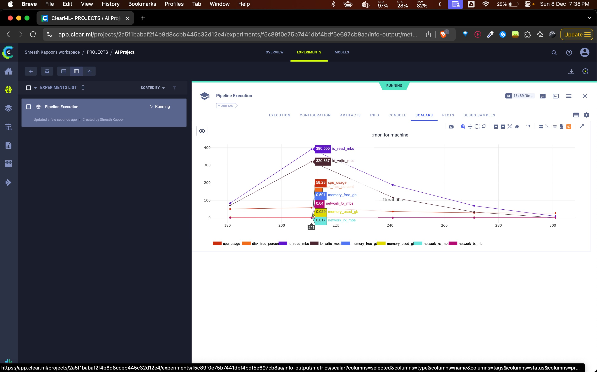

# ROS Query App — RAG-Powered Q&A for Robot Operating System

> **CS-GY-6613: Artificial Intelligence | NYU Tandon School of Engineering**
> Shresth Kapoor (sk11677) · Krish Murjani (km6520)

A Retrieval-Augmented Generation (RAG) system that answers natural-language queries about the Robot Operating System (ROS). The pipeline scrapes documentation and community content, stores it in a vector database, and serves answers through a finetuned Llama 3.2 model via an interactive Gradio web app — all launched with a single `docker-compose up`.

---

## Table of Contents
- [Overview](#overview)
- [Architecture](#architecture)
- [Tech Stack](#tech-stack)
- [Repository Structure](#repository-structure)
- [How to Run](#how-to-run)
- [Model on Hugging Face](#model-on-hugging-face)
- [Project Milestones](#project-milestones)
- [Screenshots](#screenshots)
- [Acknowledgments](#acknowledgments)

---

## Overview

The system answers questions like:
- *"What is the latest version of ROS?"*
- *"How do I navigate to a specific pose with replanning?"*
- *"What are the steps to install ROS?"*

It combines semantic search over a curated ROS knowledge base (Qdrant + Sentence-BERT) with a finetuned Llama 3.2 language model, orchestrated via ClearML.

---

## Architecture

```
┌──────────────────────────────────────────────────────────┐
│                       User Query                         │
└────────────────────────────┬─────────────────────────────┘
                             │
                     Gradio Web App
                             │
               ┌─────────────▼───────────────┐
               │         RAG Pipeline         │
               │  Sentence-BERT Embeddings    │
               │  + Qdrant Vector Search      │
               └─────────────┬───────────────┘
                             │  Retrieved context
               ┌─────────────▼───────────────┐
               │  Finetuned Llama 3.2 via     │
               │          Ollama              │
               └─────────────┬───────────────┘
                             │
                       Final Answer

Data Sources: GitHub ROS repos · Medium ROS articles → MongoDB
```

---

## Tech Stack

| Layer | Technology |
|---|---|
| Language | Python |
| Containerization | Docker, docker-compose |
| Data Storage | MongoDB |
| Vector Search | Qdrant |
| Embeddings | Sentence-BERT (`all-MiniLM-L6-v2`) |
| LLM Inference | Ollama (Llama 3.2, finetuned) |
| Experiment Tracking | ClearML |
| Web UI | Gradio |
| Model Hosting | Hugging Face Hub |

---

## Repository Structure

```
cs-gy-6613-final-project/
├── Dockerfile
├── docker-compose.yml
├── main.py           # Entry point — runs ETL + RAG pipeline
├── scrapper.py       # Scrapes GitHub repos & Medium articles
├── cleaning.py       # Data cleaning & chunking
├── retriever.py      # Embedding generation & Qdrant retrieval
├── webapp.py         # Gradio web app
├── requirements.txt
└── notebooks/
    ├── scraper.ipynb
    ├── scraper_medium.ipynb
    ├── cleaning.ipynb
    ├── qa_generator.ipynb
    └── finetuning-llama.ipynb
```

---

## How to Run

**Prerequisites:** Docker and docker-compose installed.

```bash
# 1. Clone the repo
git clone https://github.com/krishmurjani/cs-gy-6613-final-project.git
cd cs-gy-6613-final-project

# 2. Start all services (MongoDB, Qdrant, Ollama, App)
docker-compose up --build
```

Open the Gradio app at **[http://localhost:7860](http://localhost:7860)**

The compose file spins up four services automatically:
| Service | Role |
|---|---|
| MongoDB | Stores scraped & cleaned data |
| Qdrant | Vector search engine |
| Ollama | Serves the finetuned Llama 3.2 model |
| App | Runs the ETL pipeline and Gradio interface |

---

## Model on Hugging Face

The finetuned Llama 3.2 model trained on ROS documentation is publicly available:

**[krishmurjani/finetuned-llama on Hugging Face](https://huggingface.co/krishmurjani/finetuned-llama)**

The model card includes training details, evaluation results, and environment specs. Quick inference example:

```python
from transformers import AutoModelForCausalLM, AutoTokenizer

model = AutoModelForCausalLM.from_pretrained("krishmurjani/finetuned-llama")
tokenizer = AutoTokenizer.from_pretrained("krishmurjani/finetuned-llama")

inputs = tokenizer("How can I navigate to a specific pose using ROS?", return_tensors="pt")
outputs = model.generate(**inputs, max_new_tokens=200)
print(tokenizer.decode(outputs[0], skip_special_tokens=True))
```

---

## Project Milestones

### 1. Environment & Tooling
Containerized development environment via `docker-compose.yml` with MongoDB, Qdrant, Ollama, and the application container.

### 2. ETL Pipeline
Scrapes GitHub repositories and Medium articles related to ROS; stores raw and processed data in MongoDB.

### 3. Featurization Pipeline
Chunks and cleans scraped data, generates Sentence-BERT embeddings (`all-MiniLM-L6-v2`), and stores vectors in Qdrant.

### 4. Finetuning
Finetuned Llama 3.2 on Kaggle using a QA dataset generated from the scraped corpus. Model uploaded to Hugging Face Hub.

### 5. Gradio Web App
Interactive interface with pre-loaded ROS queries. Uses the full RAG pipeline — semantic retrieval → Ollama LLM → answer.

---

## Screenshots

### App Demo


### Docker Containers Running


### ClearML Pipeline Logs





---

## Acknowledgments

| | GitHub | Hugging Face |
|---|---|---|
| Krish Murjani | [@krishmurjani](https://github.com/krishmurjani) | [@krishmurjani](https://huggingface.co/krishmurjani) |
| Shresth Kapoor | [@shresthkapoor7](https://github.com/shresthkapoor7) | [@shresthkapoor7](https://huggingface.co/shresthkapoor7) |

---

**Created for CS-GY-6613: Artificial Intelligence — NYU Tandon School of Engineering**
